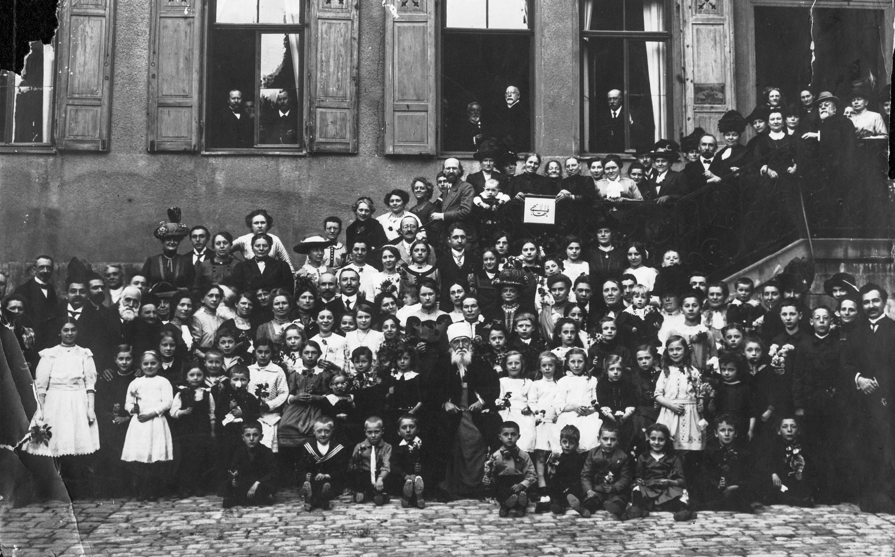

<Prose>
    In 2021, the Bahá’í community will 
    <q className="ml-2">
        mark the centenary of the Ascension of ‘Abdu’l-Bahá, that moment when the beloved Master was released from the confines of this world to rejoin His Father in the retreats of celestial glory.
    </q>
</Prose>

<SongCollection>
    <Song songSlug="im-herzen-abdul-bahas" />
    <Song songSlug="zu-allen-zeiten" />
    <Song songSlug="at-all-times" />
    <Song songSlug="at-all-times-2" />
    <Song songSlug="fasst-gottes-gewand" />
    <Song songSlug="where-there-is-love" />
</SongCollection>

<Prose>
    What other songs should we add to this collection? Please <a href="/contact">tell us</a>.
</Prose>