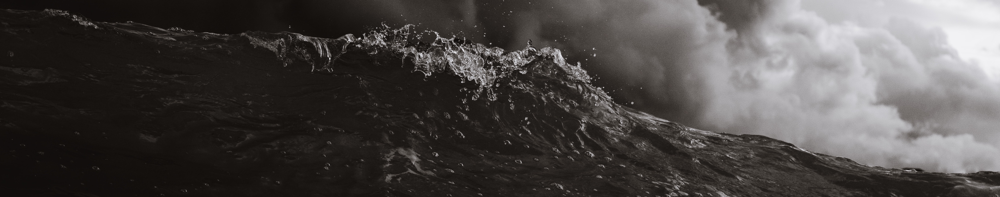
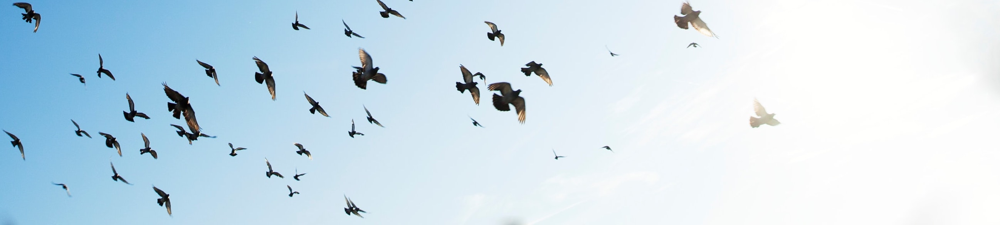

<Prose>
  <h3>Is there any remover of difficulties save God?</h3>
</Prose>

<Prose>
  Songs based on a prayer of the Báb:
  <blockquote>
    Is there any Remover of difficulties save God? Say: Praised be God! He is
    God! All are His servants, and all abide by His bidding!
  </blockquote>
</Prose>

<SongCollection>
  <Song songSlug="is-there-any-remover" />
  <Song songSlug="kodi-palinso-wina" />
  <Song songSlug="iparhi-allos-litrotis" />
  <Song songSlug="kuna-mtu" />
  <Song songSlug="is-there-any-remover-of-difficulties" />
  <Song songSlug="remover-of-difficulties" />
</SongCollection>

<Prose>
  <h3>Fire Tablet</h3>
</Prose>

<Prose>
  Songs based on passages from the Fire Tablet, a tablet often recited in times
  of difficulty
</Prose>

<SongCollection>
  <Song songSlug="bear-and-endure" />
  <Song songSlug="o-fire-of-the-worlds" />
</SongCollection>

<Prose>
  <h3>Refresh and gladden my spirit</h3>
</Prose>

<Prose>
  Songs based on a prayer attributed to ʻAbdu'l-Bahá:
  <blockquote>
    O God! Refresh and gladden my spirit. Purify my heart. Illumine my powers. I
    lay all my affairs in Thy hand. Thou art my Guide and my Refuge. I will no
    longer be sorrowful and grieved; I will be a happy and joyful being. O God!
    I will no longer be full of anxiety, nor will I let trouble harass me. I
    will not dwell on the unpleasant things of life. O God! Thou art more friend
    to me than I am to myself. I dedicate myself to Thee, O Lord.
  </blockquote>
</Prose>

<SongCollection>
  <Song songSlug="corrobora" />
  <Song songSlug="refrenergy" />
  <Song songSlug="erquicke" />
</SongCollection>

<Prose>
  <h3>Relying upon God</h3>
</Prose>

<Prose>Songs based on Writings that help us rely upon God</Prose>

<SongCollection>
  <Song songSlug="armed" />
  <Song songSlug="find-me" />
  <Song songSlug="if-any-differences" />
  <Song songSlug="no-one-but-thee" />
  <Song songSlug="rely-upon-god" />
  <Song songSlug="remember-at-all-times" />
  <Song songSlug="sorrow-not" />
</SongCollection>

<Prose>
  <h3>Invoking God's help</h3>
</Prose>

<Prose>
  <blockquote>Yá Allahu'l-Mustaghath</blockquote>
  Song based on an invocation revealed by the Báb. "He prescribed it for recitation
  by His followers in times of trouble and difficulty. Shoghi Effendi has translated
  the word “Mustagháth” as “He Who is invoked for help”." (The Universal House of
  Justice, 25 November 1999)
</Prose>

<SongCollection>
  <Song songSlug="ya-allah-el-mustaghas" />
</SongCollection>

<Prose>
  Should we include other songs in this collection?{" "}
  <a href="/contact">Tell us.</a>
</Prose>
