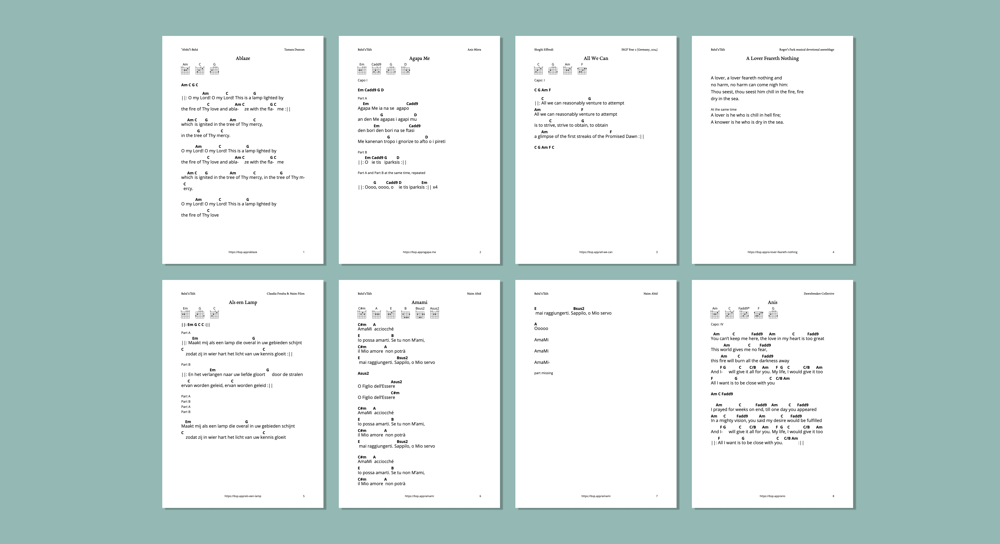

import DownloadButton from '../components/DownloadButton'

<a href="/songbook.pdf" target="_blank" rel="noopener noreferrer" className="font-bold">Download Song Book
    <svg className="fill-current stroke-current w-4 ml-1 inline " viewBox="0 0 20 20">
        <path d="M11 3a1 1 0 100 2h2.586l-6.293 6.293a1 1 0 101.414 1.414L15 6.414V9a1 1 0 102 0V4a1 1 0 00-1-1h-5z"></path>
        <path d="M5 5a2 2 0 00-2 2v8a2 2 0 002 2h8a2 2 0 002-2v-3a1 1 0 10-2 0v3H5V7h3a1 1 0 000-2H5z"></path>
    </svg>
</a>

**Please note**

- The table of contents looks like a numbered list, but the number actually indicates the page number for the song. This is a known issue of the program we are using to generate the song book and will hopefully be fixed in the future.
- When you click on the title in the table of contents, you will jump to the song.
- This is an early version of the song book and it will contain errors. If you find any, please [tell us](https://bahaisongproject.com/contact).

